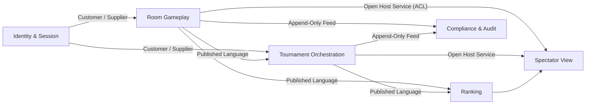

# 02 — Bounded Contexts and Context Map

## Proposed bounded contexts

### 1. Room Gameplay Context
**Purpose**  
Owns the authoritative state and rules of a room session: roster lock, turn order, legal actions, card effects, Uno call timing, challenge outcomes, disconnect skip behavior, match progression inside the room, and room completion.

**Owns**
- Room lifecycle: `waiting -> in_progress -> completed`
- Seat order and active turn
- Active game state and match series state
- Hidden and public card state
- Challenge windows and disconnect windows
- Casual room final placement
- Tournament room match outcome and advancement-ready summary

**Does not own**
- Tournament-wide seeding or bracket creation
- Global player identity
- Long-term rankings
- Spectator-specific projections

### 2. Tournament Orchestration Context
**Purpose**  
Owns tournament lifecycle, player registration eligibility, rounds, room assignment, advancement, elimination, final room creation, and tournament completion.

**Owns**
- Tournament metadata and status
- Round creation and closure
- Room assignment for each round
- Advancement rules:
  - top 3 by match wins
  - then lower cumulative card-point total
  - then earliest final-game completion
- Final room trigger when 10 or fewer players remain
- Tournament placement rating triggers

**Does not own**
- In-room card legality or turn-by-turn gameplay
- Casual Elo
- Session authentication internals

### 3. Ranking Context
**Purpose**  
Owns durable player ratings and rating history.

**Owns**
- Casual Elo rating
- Tournament placement rating
- Rating history and auditability
- “No Elo update for abandoned games” rule

**Does not own**
- Determining gameplay legality
- Deciding tournament advancement
- Identity/session enforcement

### 4. Identity & Session Context
**Purpose**  
Owns player identity, authentication state, single-active-session enforcement, and session invalidation semantics.

**Owns**
- Player account identity
- Session issuance and revocation
- New-login-invalidates-old-session rule
- Session validity checks for commands
- Security-oriented audit events

**Does not own**
- Room gameplay state
- Tournament ranking
- Spectator projections

### 5. Spectator View Context
**Purpose**  
Owns read-only public room and tournament views for spectators.

**Owns**
- Public room snapshot and update feed
- Public match scoreboard
- Public tournament bracket and progression views
- Privacy filtering

**Does not own**
- Gameplay decisions
- Hidden state
- Tournament authority

### 6. Compliance & Audit Context
**Purpose**  
Owns immutable recordkeeping for sensitive actions and dispute-oriented traceability.

**Owns**
- Signed or tamper-evident domain audit trails
- High-sensitivity event history:
  - shuffles and draws
  - penalties
  - forfeits
  - rating changes
  - session invalidations
  - tournament advancement decisions

**Does not own**
- Primary decision-making for gameplay or tournaments

## Why these boundaries are appropriate

The main separation is between:

1. **Immediate consistency domains**  
   - Room Gameplay
   - Identity & Session

2. **Coordination domains**  
   - Tournament Orchestration

3. **Eventually consistent domains**  
   - Ranking
   - Spectator View
   - Audit/Compliance

This keeps the most timing-sensitive invariants inside a single authoritative gameplay boundary while allowing tournament, ranking, and read models to evolve via domain events.

## Context map

## Relationship descriptions

### Identity & Session -> Room Gameplay
**Type**: Customer / Supplier (C/S)  
Room Gameplay depends on session validity and single-active-session semantics before accepting commands.

### Identity & Session -> Tournament Orchestration
**Type**: Customer / Supplier (C/S)  
Tournament enrollment, rejoin rights, and elimination identity integrity depend on canonical player/session identity.

### Room Gameplay -> Tournament Orchestration
**Type**: Published Language (PL) / Event-Driven  
Tournament Orchestration consumes authoritative room outcomes, never infers them. It reacts to room completion and match result events.

### Room Gameplay -> Ranking
**Type**: Published Language (PL) / Event-Driven  
Ranking consumes authoritative completed casual game placements and ignored-abandonment decisions.

### Room Gameplay -> Spectator View
**Type**: Open Host Service (OHS) / Anti-Corruption Layer (ACL)  
Spectator View receives only sanitized public events and snapshots, never private hand state or hidden deck information. The ACL protects public consumers from hidden internal representations.

### Tournament Orchestration -> Spectator View
**Type**: Open Host Service (OHS)  
Bracket creation, round progression, elimination, and final placements become public tournament views.

### Room Gameplay + Tournament Orchestration -> Compliance & Audit
**Type**: append-only audit feed  
Sensitive, dispute-relevant decisions are persisted independently from operational write models.

## Explicit treatment of Spectator View boundary

The assignment explicitly requires this boundary to be handled carefully.

### Information that may cross into Spectator View
Spectator View may receive only **publicly observable** room and tournament state, such as:

- room identifier and type
- room lifecycle status
- player display names / seat order
- whose turn it is
- discard stack and current chosen color
- public penalties and challenge outcomes
- public hand counts, if confirmed to be intended public state
- game number within a match
- match win counts
- eliminations and advancement results
- tournament bracket progress and final standings

### Information that must never cross the boundary
- any player's private hand contents
- draw pile order
- future random outcomes
- hidden server-side integrity tokens
- session tokens or session linkage
- privileged moderation metadata
- internal fraud/risk indicators unless separately approved

### Domain events driving Spectator View
Examples:
- `RoomCreated`
- `RoomRosterLocked`
- `GameStarted`
- `TurnBegan`
- `CardPlayedPubliclyVisible`
- `ColorChosen`
- `UnoChallengeWindowOpened`
- `UnoChallengeResolved`
- `PlayerDisconnected`
- `PlayerReconnected`
- `PlayerForfeited`
- `GameCompleted`
- `MatchScoreUpdated`
- `RoomCompleted`
- `TournamentRoundStarted`
- `PlayersAdvanced`
- `PlayersEliminated`
- `TournamentCompleted`

### Privacy policy inside the domain
The privacy rule is not left to transport-layer filtering alone.  
Instead, the domain model publishes two conceptual categories of events:

1. **Authoritative gameplay events** for internal bounded contexts.
2. **Public gameplay events** for spectator consumption.

That makes privacy an explicit domain contract rather than an accidental projection detail.

## Boundary decisions worth defending in review

### Why Ranking is separate from Room Gameplay
Because rating changes are consequences of completed outcomes, not part of deciding legal card play. The room must finish authoritatively even if ranking updates are delayed.

### Why Tournament Orchestration is separate from Room Gameplay
Because tournament progression coordinates many rooms and rounds. It should consume room results, not participate in per-turn consistency.

### Why Spectator View is separate from Room Gameplay
Because spectator scale, privacy filtering, and public projection requirements differ from authoritative gameplay rules. A dedicated public language prevents leakage of hidden state.

### Why Identity & Session is separate
Because single-active-session, login invalidation, and session abuse controls are cross-cutting identity concerns, not room rules.
