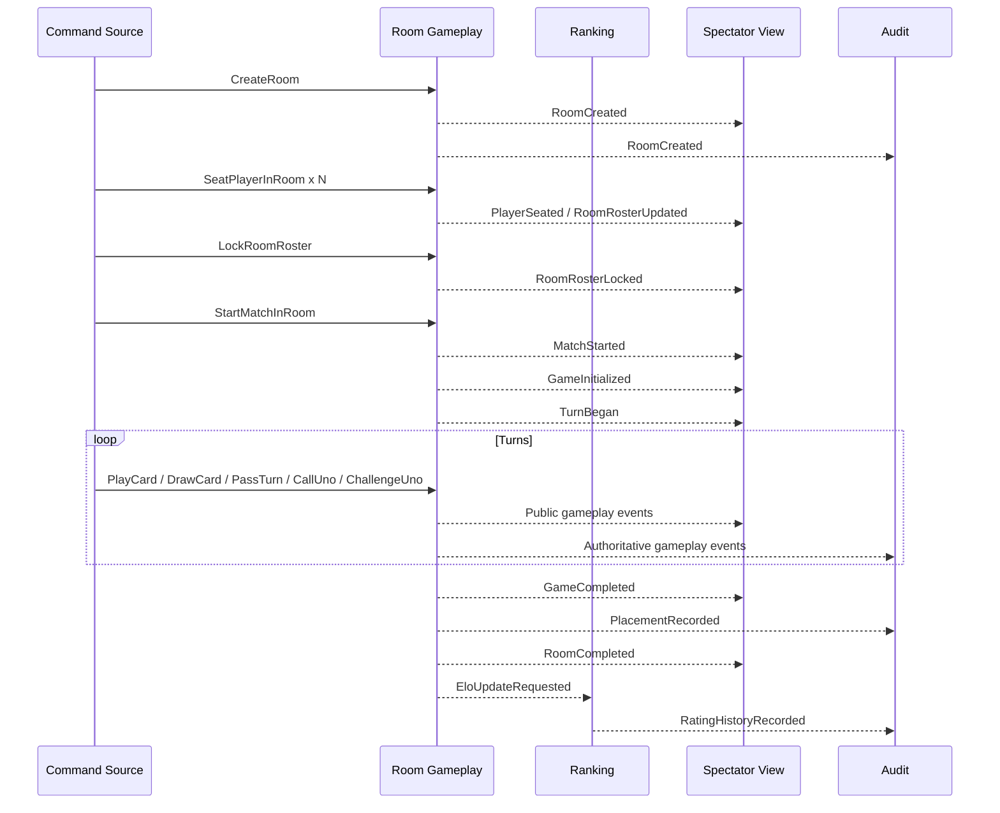
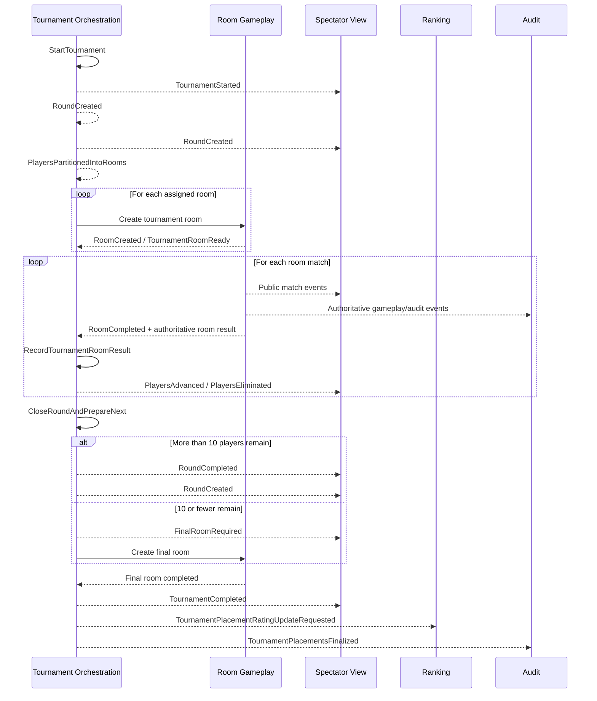
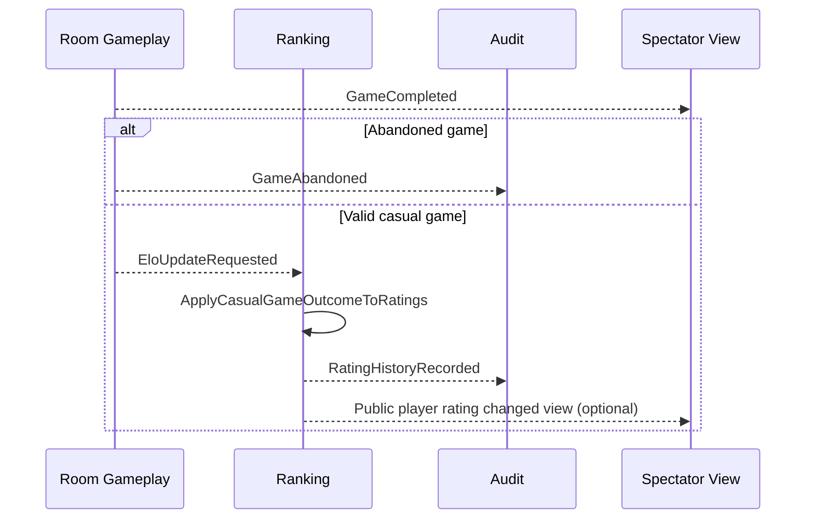

# 05 — Domain Event Flow Narratives

This document provides end-to-end domain event narratives for the required flows. The emphasis is on **authoritative decisions, event causality, and where asynchronous propagation is acceptable**.

---

# 1. Room creation to completion

## 1.1 Casual room flow

### Narrative
1. A player creates a casual room.
2. Additional players join and are seated.
3. The roster is locked and the room starts.
4. One game is played authoritatively inside the room.
5. The game ends with final placement.
6. The room completes.
7. Casual Elo updates are requested and applied asynchronously.

### Event sequence

## 1.2 Synchronous decision points inside the room
These must be decided immediately inside the `RoomSession` aggregate:

- whether the acting player is the current turn owner
- whether the command sequence matches the room version
- whether a card play is legal
- whether a wild requires color choice
- whether a player now has exactly one card
- whether an Uno declaration was timely
- whether a challenge is still within the allowed window
- whether a disconnect causes a skip or a forfeit
- whether the game has completed
- whether the room has completed

## 1.3 Asynchronous propagation after room completion
These can happen after the room's authoritative decision:
- spectator/public projection refresh
- audit persistence
- casual Elo updates
- analytics updates

The room is complete even if these downstream consumers lag.

---

# 2. Tournament round advancement

## 2.1 Narrative
1. Tournament registration closes.
2. Tournament starts and creates round 1.
3. Eligible players are partitioned into room assignments.
4. Tournament rooms are created in the Room Gameplay context.
5. Each room plays a best-of-three match.
6. Each completed room emits an authoritative result.
7. TournamentRound consumes room results idempotently.
8. Top 3 players advance by rule:
   - higher match wins
   - lower cumulative card-point total
   - earliest final-game completion
9. Once all rooms in the round are resolved, the round closes.
10. If more than 10 players remain, a new round is created; otherwise a final room is created.
11. The final room resolves and the tournament completes.

## 2.2 Event sequence

## 2.3 Critical business decisions in this flow

### Authoritative in Room Gameplay
- actual match wins
- cumulative card-point totals
- final-game completion timestamps for tie-break use
- player forfeits inside the room

### Authoritative in Tournament Orchestration
- round completion
- advancement/elimination decisions from reported room results
- final room trigger
- tournament completion

## 2.4 Result report contract between contexts
A tournament room result consumed by Tournament Orchestration must include enough authoritative facts to decide advancement without re-simulating gameplay:

- tournament id
- round id
- room id
- final roster
- match wins per player
- cumulative card-point total per player
- final-game completion timestamp per player or tie-break-relevant completion marker
- eliminated/forfeited indicators
- unique room completion event id

This keeps Tournament Orchestration downstream of gameplay authority.

---

# 3. Elo/ranking updates after game completion

## 3.1 Narrative
1. A casual game completes.
2. Room Gameplay finalizes placement order.
3. If the game is abandoned, it emits `GameAbandoned` and no Elo update is requested.
4. If the game is valid and casual, Ranking is asked to apply the outcome.
5. Ranking updates each affected player's casual Elo exactly once.
6. Rating history is recorded.

## 3.2 Event sequence

## 3.3 Synchronous vs asynchronous split
### Synchronous in Room Gameplay
- deciding that a game ended
- final placement
- whether the game is abandoned
- whether the room is casual

### Asynchronous in Ranking
- calculating and applying deltas
- writing rating history
- refreshing public leaderboard projections

## 3.4 Why this split is correct
If rating application fails temporarily, the underlying game result must remain valid. Therefore, rating mutation is a consequence, not a prerequisite, of gameplay completion.

---

# 4. Failure-aware variants of the flows

## 4.1 Stale move during active game
1. Player sends `PlayCard` with old expected sequence.
2. Room rejects command.
3. Event emitted: `StaleCommandRejected`.
4. No game state changes.
5. Client must reconcile from authoritative stream or fresh query.

## 4.2 Disconnect during player's turn
1. Player disconnects.
2. `PlayerDisconnected` and `ReconnectWindowOpened`.
3. If their turn is active, turn is skipped according to policy.
4. If reconnect succeeds before expiry, `PlayerReconnected`.
5. If expiry occurs during their turn, `PlayerForfeited`.

## 4.3 Duplicate tournament result report
1. `RoomCompleted` is delivered twice.
2. TournamentRound matches prior processed completion id.
3. Second report is ignored idempotently.
4. Optional audit event: `ReplayCommandIgnored` or `DuplicateRoomResultIgnored`.

---

# 5. Flow-level invariants

## Room flow invariants
- only one authoritative room completion exists
- private hands never cross into public spectator events
- a stale action cannot mutate room state
- a reconnect never changes the hand contents

## Tournament flow invariants
- a room result affects exactly one round
- one player may occupy only one room in a round
- advancement from a room is computed once from the authoritative room result
- final room is created only when remaining players are 10 or fewer

## Ranking flow invariants
- casual Elo updates only from non-abandoned casual game outcomes
- the same outcome cannot be applied twice
