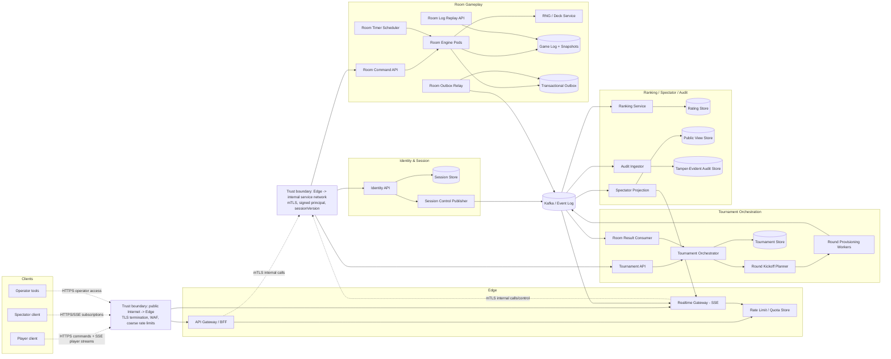
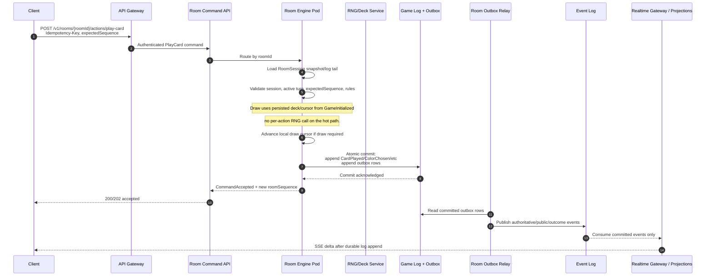
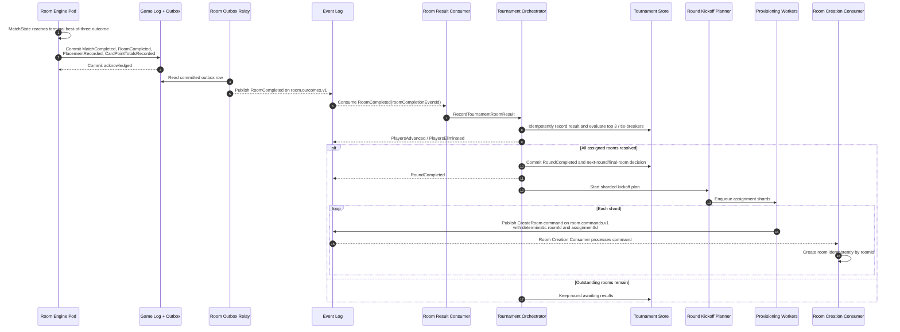

# 10 - Architecture Overview

This document translates the approved DDD design into a microservices-oriented architecture. The domain design artifacts `01` through `09` remain the source of truth for language, commands, events, invariants, and failure behavior.

## 1. Architectural stance

UnoArena is modeled as an event-driven system with strong consistency inside each authoritative command boundary and eventual consistency for downstream read models, ranking, audit copies, and spectator projections.

Key decisions:

- Clients submit commands through REST and receive realtime updates through SSE.
- The edge/API gateway and realtime gateway are cross-cutting containers, not bounded contexts.
- Each bounded context owns its data. There is no shared operational database across contexts.
- Room Gameplay is the immediate consistency core. Each `RoomSession` serializes accepted gameplay commands by `expectedSequence`.
- Authoritative gameplay writes are durably appended before any player, spectator, ranking, tournament, or audit broadcast sees them.
- Public spectator state is materialized from a first-class public projection, not from a last-minute transport filter.
- Tournament round kickoff and round completion are process-managed workflows with sharded fan-out and idempotent commands.

## 2. Context-to-container map

| Bounded context | Main deployable containers | Primary data ownership | Main published language |
|---|---|---|---|
| Identity & Session | Identity API, Session Store, Session Control Publisher | accounts, active session version, revoked sessions, security audit facts | `PlayerLoggedIn`, `PreviousSessionInvalidated`, `ActiveSessionIssued`, `SessionInvalidated`, `SessionClosed` |
| Room Gameplay | Room Command API, Room Engine Pods, Room Timer Scheduler, RNG/Deck Service, Room Outbox Relay, Room Log Replay API | `RoomSession`, game log, room snapshots, command dedupe, durable timer deadlines | `RoomCreated`, `MatchStarted`, `GameInitialized`, `CardPlayed`, `CardDrawn`, `UnoDeclared`, `ReconnectWindowOpened`, `GameCompleted`, `GameAbandoned`, `MatchCompleted`, `RoomCompleted` |
| Tournament Orchestration | Tournament API, Tournament Orchestrator, Round Provisioning Workers, Room Result Consumer, Round Kickoff Planner | `Tournament`, `TournamentRound`, assignments, advancement decisions, provisioning state | `TournamentStarted`, `RoundCreated`, `PlayersPartitionedIntoRooms`, `TournamentRoomProvisionRequested`, `TournamentRoomResultRecorded`, `PlayersAdvanced`, `PlayersEliminated`, `RoundCompleted`, `FinalRoomCreated`, `TournamentCompleted` |
| Ranking | Ranking API, Rating Command Consumer, Leaderboard Projection Workers | `RatingProfile`, rating history, processed outcome ids, leaderboard projections | `EloUpdateRequested`, `EloUpdated`, `TournamentPlacementRatingUpdateRequested`, `TournamentPlacementRatingUpdated`, `RatingHistoryRecorded` |
| Spectator View | Spectator Projection Ingestors, Public Room View API, Public Tournament View API, Spectator Stream Publisher | public room snapshots, public room deltas, public bracket views | `PublicRoomSnapshotPublished`, `BracketProjectionUpdated`, public envelopes of room/tournament events |
| Compliance & Audit | Audit Ingestor, Tamper-Evident Audit Store, Dispute Replay API | immutable audit records, event hashes, replay exports, access records | sensitive copies of gameplay, session, ranking, and tournament decisions |

## 3. Container view

## 4. Runtime home for mandatory invariants

| Guarantee | Owning component/layer | Failure and restart behavior |
|---|---|---|
| Sequence-number enforcement | Room Command API validates request shape; Room Engine Pods enforce it inside the `RoomSession` command handler with optimistic append on `(roomId, sequence)` | If a pod restarts after receiving a command but before commit, the client retries with the same `actionId`; the recovered room snapshot/game log decides whether it was accepted or rejected. Stale or replayed commands emit `StaleCommandRejected` or `ReplayCommandIgnored`. |
| Log-before-broadcast atomicity | Room Engine transaction appends authoritative events to the immutable game log and writes outbox rows in the same commit. Room Outbox Relay publishes only committed outbox rows | A crash after commit but before publish leaves outbox rows pending. A crash before commit publishes nothing. Therefore no client sees a state change that is absent from the game log. |
| 5-second Uno challenge window | Room Engine persists `UnoChallengeWindow` with `expiresAt`; Room Timer Scheduler scans durable deadlines and sends `ExpireChallengeWindow` internally; Room Engine emits `UnoChallengeWindowClosed` with `closureReason=expired` or closes it earlier on `TurnBegan` | Scheduler workers are stateless and partitioned. On restart they reload due deadlines from the room timer table. Expiry command id is `roomId:gameId:challengeWindowId:expiresAt`, so duplicate expiries are ignored. |
| 60-second reconnection window | Realtime Gateway detects player stream loss via Realtime Connection Registry (tracking `sessionId`, `playerId`, `roomId`, `connectionId`, `lastSeenAt`); heartbeat writes run about every 5 seconds, a connection is stale after 10 seconds, and normal maximum detection latency is about 15 seconds. Room Engine persists `DisconnectWindow` with `disconnectedAt=lastSeenAt` and `reconnectDeadline=lastSeenAt+60s`; Room Timer Scheduler later sends `ExpireReconnectWindow` | If the gateway dies, a Session Continuity Worker reconciles by scanning stale Connection Registry records and issuing idempotent `MarkPlayerDisconnected` commands. The persisted deadline is recovered on scheduler restart. `ReconnectPlayer` and `ExpireReconnectWindow` race through the same room sequence, so exactly one of `PlayerReconnected` or `ReconnectWindowExpired`/`PlayerForfeited` wins. |
| Single-active-session | Identity API updates `PlayerSession` and writes `PreviousSessionInvalidated`; Session Control Publisher fans out invalidation to Realtime Gateway instances and API auth caches | A new login is durable before the new token is returned. If a gateway misses the push, its short-lived auth cache also checks session version; stale SSE streams are closed when the control event is replayed or on next heartbeat/session-version check. |
| Spectator projection privacy | Spectator Projection Ingestor consumes only public gameplay/tournament topics and validates schemas against an allow-list before writing Public View Store | If a malformed public event contains private fields, the ingestor rejects and quarantines it, emits `PublicProjectionSchemaViolationDetected`, and does not update the public view. |
| Match series coordination | Room Engine owns `MatchState` inside `RoomSession`; `AdvanceMatchSeries` starts game 2/3 or emits `MatchCompleted`; Tournament Orchestration consumes only final `RoomCompleted` outcomes | Room restart reloads `MatchState` from the game log/snapshot. A duplicate `GameCompleted` cannot start a duplicate next game because `AdvanceMatchSeries` is idempotent by `gameId` and room sequence. |
| Abandoned vs completed outcomes | Room Engine decides `GameCompleted` versus `GameAbandoned` and includes `roomType`, `outcomeKind`, and `sourceGameOutcomeId`; Ranking consumes only `EloUpdateRequested` for non-abandoned casual games | If a ranking consumer receives an abandoned or tournament outcome by mistake, it rejects/ignores by policy and records an audit event instead of applying Elo. Tournament forfeits are represented in the room result consumed by Tournament Orchestration. |

## 5. Intra-context sequence: play card with log-before-broadcast

The command response may return before every downstream consumer has caught up, but it never returns success before the authoritative transaction has committed.

## 6. Cross-context sequence: tournament room completion to next round kickoff

Tournament Orchestration never recomputes card legality and never advances players without the authoritative room result facts documented in `05-domain-event-flows.md`.

## 7. Traceability summary

The architecture deliberately uses the command and event names from `04-commands-and-domain-events.md`:

- REST operations map to commands such as `CreateRoom`, `StartMatchInRoom`, `PlayCard`, `ChallengeUno`, `RegisterPlayerForTournament`, `StartTournament`, and `LoginPlayer`.
- Async topics carry documented domain events such as `RoomCompleted`, `TournamentRoomResultRecorded`, `EloUpdateRequested`, `PreviousSessionInvalidated`, and `PublicRoomSnapshotPublished`.
- Internal technical messages may wrap a domain command, but they do not rename the business fact. For example, the timer scheduler sends an internal expiry command that results in the documented `UnoChallengeWindowClosed` or `ReconnectWindowExpired` events.
